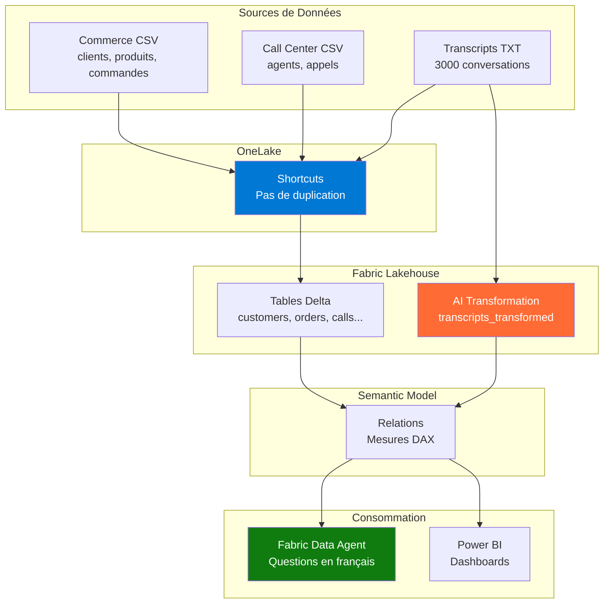

# Customer 360 + Call Center - Démo Microsoft Fabric

[](https://fabric.microsoft.com/)
[](https://www.python.org/)
[](LICENSE)

> Démo complète de **Microsoft Fabric** avec OneLake, Shortcut Transformations AI, et Fabric Data Agent pour une vue 360° des clients combinant données transactionnelles et conversationnelles.

---

## 🎯 Objectif de la Démo

Cette démo illustre comment **Microsoft Fabric** permet de :

1. **Unifier les données** commerce (achats) et call center (support) dans **OneLake**
2. **Transformer automatiquement** des transcripts texte (.txt) en tables queryables avec **AI Shortcut Transformations**
3. **Interroger les données en langage naturel** avec le **Fabric Data Agent**
4. **Analyser l'impact** du service client sur les ventes et la fidélisation

**Cas d'usage** : Identifier les produits problématiques, les clients à risque de churn, l'efficacité des agents, et mesurer le ROI du support client.

---

## 🏗️ Architecture



**Flux de données** :
1. Génération locale de données synthétiques (Python)
2. Upload vers OneLake (via shortcuts ou direct)
3. Transformation AI des transcripts (sentiment, résumé, PII detection)
4. Chargement en tables Delta
5. Création d'un modèle sémantique (relations + mesures)
6. Interrogation via Data Agent + visualisation Power BI

---

## 📊 Données Générées

| Type | Fichier | Volume | Description |
|------|---------|--------|-------------|
| **Commerce** | `customers.csv` | 500 lignes | Clients (nom, email, segment, loyalty points) |
| | `products.csv` | 80 lignes | Produits (5 catégories, prix 20-3000€) |
| | `orders.csv` | 20 000 lignes | Commandes (statut, dates, paiement) |
| | `order_lines.csv` | ~60 000 lignes | Détails des commandes (produit, quantité, prix) |
| **Call Center** | `agents.csv` | 25 lignes | Agents (expérience junior/senior/expert) |
| | `calls.csv` | 3 000 lignes | Appels (raison, satisfaction, résolution) |
| | `transcripts_txt/*.txt` | 3 000 fichiers | Conversations client/agent en français |

**Période** : 6 mois (août 2025 → janvier 2026)  
**Seed** : 42 (reproductibilité garantie)  
**Format** : CSV UTF-8, dates ISO 8601, noms de colonnes snake_case

### Relations Clés

```
customers (1) ←→ (N) orders ←→ (N) order_lines ←→ (N) products
customers (1) ←→ (N) calls ←→ (1) transcripts
calls (N) ←→ (1) agents
calls (N) ←→ (1) orders [optionnel, 30% des cas]
```

---

## 🚀 Quick Start

### 1. Générer les Données

```bash
# Cloner le repo
git clone <repo-url>
cd Roadshow

# Installer les dépendances
pip install -r requirements.txt

# Générer toutes les données
cd src
python generate_data.py
```

**Résultat** : Les fichiers sont créés dans `data/raw/` (commerce + callcenter).

### 2. Déployer dans Microsoft Fabric

Suivre le guide complet dans [`docs/fabric_setup.md`](docs/fabric_setup.md) :

1. Créer un Lakehouse
2. Uploader les données vers OneLake
3. Appliquer AI Transformations sur les transcripts
4. Charger les CSV en tables Delta
5. Créer un Semantic Model avec relations
6. Configurer le Fabric Data Agent
7. Tester avec les questions de démo

**Durée** : 30-45 minutes

### 3. Lancer le Data Agent

Poser des questions en français :

```
Combien de clients ont appelé après une commande ?
Quels produits génèrent le plus d'appels pour panne ?
Quel est le taux de satisfaction moyen des appels ?
```

Voir [`docs/questions_demo.md`](docs/questions_demo.md) pour 15 questions "wow effect".

---

## 📚 Documentation

| Document | Description |
|----------|-------------|
| [`docs/schema.md`](docs/schema.md) | Schéma complet des tables (colonnes, types, relations, index) |
| [`docs/demo_story.md`](docs/demo_story.md) | Scénario narratif de la démo (Sophie la cliente mécontente) |
| [`docs/dax_measures.md`](docs/dax_measures.md) | 40+ mesures DAX validées et testées |
| [`docs/questions_demo.md`](docs/questions_demo.md) | 15 questions à poser au Data Agent (ordre recommandé) |
| [`docs/fabric_setup.md`](docs/fabric_setup.md) | Guide step-by-step pour déployer dans Fabric |
| [`docs/data_agent_instructions.md`](docs/data_agent_instructions.md) | Instructions (system prompt) pour le Data Agent |
| [`docs/data_agent_examples.md`](docs/data_agent_examples.md) | 20 exemples de questions/réponses attendues |

---

## 🔧 Configuration

Tous les paramètres de génération sont dans [`src/config.yaml`](src/config.yaml) :

```yaml
# Volumes
volumes:
  customers: 500
  products: 80
  orders: 20000
  calls: 3000

# Période
date_range:
  start: "2025-08-01"
  end: "2026-01-28"

# Comportements
business_params:
  calls:
    call_probability_after_order: 0.15
    resolution_rate: 0.75
  transcripts:
    language: "fr"
    include_fake_pii: true
```

Ajuster les valeurs et relancer `generate_data.py` pour régénérer.

---

## 💡 Use Cases Démontrés

### 1. Customer 360

**Question** : "Donne-moi l'historique complet du client CUST_000123"

**Réponse** : Toutes les commandes, appels, sentiment des conversations, évolution dans le temps.

### 2. Analyse de Churn

**Question** : "Quels clients n'ont pas racheté après un appel non résolu ?"

**Insight** : 67 clients à risque identifiés → campagne de rétention.

### 3. Qualité Produit

**Question** : "Quels produits génèrent le plus d'appels pour panne ?"

**Insight** : Aspirateur robot PROD_00012 = 3x plus de pannes → alerte fournisseur.

### 4. Performance Agents

**Question** : "Quel agent a le meilleur taux de résolution ?"

**Insight** : Agents experts = 92% résolution vs 68% juniors → formation nécessaire.

### 5. Impact du Support sur les Ventes

**Question** : "Les clients qui appellent dépensent-ils plus ?"

**Insight** : +15% de CA pour les callers (engagement élevé).

---

## 🎨 Capture d'Écran (Exemples)

### Fabric Data Agent

```
User: "Combien de clients avons-nous au total ?"

Agent: "500 clients au total, répartis en 3 segments :
        - Premium : 75 (15%)
        - Regular : 300 (60%)
        - Occasional : 125 (25%)"
```

### Power BI Dashboard

*(Insérer screenshot ici après création)*

---

## 🛠️ Technologies Utilisées

- **Microsoft Fabric** : Lakehouse, OneLake, Shortcuts, AI Transformations, Data Agent
- **Delta Lake** : Format de tables (ACID transactions, time travel)
- **Python** : Génération de données (Faker, Pandas)
- **Power BI** : Visualisation (Semantic Model, DAX)

---

## ⚠️ Avertissements

### Données Fictives

**Toutes les données sont 100% synthétiques** :
- Noms générés par Faker
- Emails/téléphones fictifs (pas de PII réelle)
- Transcripts créés par templates

**Ne contient AUCUNE donnée réelle d'entreprise ou de client.**

### Preview Features

Certaines fonctionnalités sont en **preview** dans Fabric (janvier 2026) :
- AI Shortcut Transformations
- Fabric Data Agent (Copilot for Data)

Les résultats peuvent varier selon l'évolution du produit.

---

## 🔍 Troubleshooting

### Problème : Les transcripts ne sont pas transformés

**Solution** : Vérifier que la preview AI Transformations est activée dans le tenant. Voir [`docs/fabric_setup.md`](docs/fabric_setup.md) section "Troubleshooting".

### Problème : Le Data Agent répond mal

**Solution** : Vérifier les relations dans le Semantic Model, reformuler avec des termes exacts des colonnes.

### Problème : Erreurs de type de données

**Solution** : Réimporter les CSV avec `inferSchema=True` ou caster manuellement les colonnes (voir guide Fabric).

### Problème : Encodage des fichiers

**Solution** : S'assurer que tous les CSV sont en UTF-8 sans BOM. Regenerer avec `python generate_data.py`.

---

## 📖 Pour Aller Plus Loin

### Étendre la Démo

1. **Ajouter d'autres sources** : Réseaux sociaux, chatbot logs, avis produits
2. **Intégrer Azure OpenAI** : Générer des résumés plus avancés, recommandations produits
3. **Créer des alertes** : Notifications automatiques pour clients à risque
4. **Ajouter du streaming** : Simuler des appels en temps réel avec Event Hub

### Adapter à d'Autres Secteurs

- **Banque** : Remplacer commandes → contrats, appels → réclamations
- **Telecom** : Abonnements → plans tarifaires, appels → tickets techniques
- **Healthcare** : Patients → patients, commandes → rendez-vous (attention RGPD)

Voir [`docs/demo_story.md`](docs/demo_story.md) pour des variations sectorielles.

---

## 🤝 Contribution

Ce repo est conçu pour être **forké et personnalisé** :

1. Ajuster les volumes dans `config.yaml`
2. Modifier les templates de transcripts dans `generate_data.py`
3. Ajouter de nouvelles mesures DAX dans le Semantic Model
4. Créer de nouveaux dashboards Power BI

Pull requests bienvenues pour améliorer les templates ou la documentation !

---

## 📄 Licence

MIT License - Utilisation libre pour démos, formations, POCs.

**Disclaimer** : Ce code est fourni "as-is" sans garantie. Les données générées sont fictives et ne doivent pas être utilisées en production.

---

## 🎓 Ressources Complémentaires

- [Documentation Microsoft Fabric](https://learn.microsoft.com/en-us/fabric/)
- [OneLake Shortcuts](https://learn.microsoft.com/en-us/fabric/onelake/onelake-shortcuts)
- [AI Transformations](https://learn.microsoft.com/en-us/fabric/data-engineering/ai-transformations)
- [Fabric Data Agent](https://learn.microsoft.com/en-us/fabric/data-science/data-agent)
- [Delta Lake](https://delta.io/)

---

## 📞 Contact

Pour questions ou support sur cette démo :

- Ouvrir une issue sur GitHub
- Contacter l'équipe Microsoft Fabric

---

## ✅ Checklist de Déploiement

Avant de présenter la démo, vérifier :

- [ ] Données générées localement (500 clients, 3000 appels)
- [ ] Lakehouse créé dans Fabric
- [ ] Données uploadées vers OneLake
- [ ] AI Transformations appliquées sur transcripts
- [ ] 7 tables Delta créées et vérifiées
- [ ] Semantic Model configuré avec relations
- [ ] Data Agent configuré avec instructions
- [ ] Au moins 12/15 questions de test fonctionnent
- [ ] Dashboard Power BI créé
- [ ] Scénario narratif préparé ([demo_story.md](docs/demo_story.md))

**Bonne démo ! 🚀**

---

## 🏆 Résultats Attendus

Après avoir suivi ce guide, vous aurez :

✅ Une démo complète de **Microsoft Fabric** prête à présenter  
✅ Des **données cohérentes** (commerce + call center) sur 6 mois  
✅ Des **transcripts analysés par IA** (sentiment, PII, résumé)  
✅ Un **Data Agent** répondant à des questions métier en français  
✅ Un **dashboard Power BI** avec KPIs clés  
✅ Une **story narrative** pour engager l'audience  

**Durée de préparation** : 1-2 heures (génération + déploiement)  
**Durée de présentation** : 15-30 minutes  
**Wow factor** : 🔥🔥🔥

